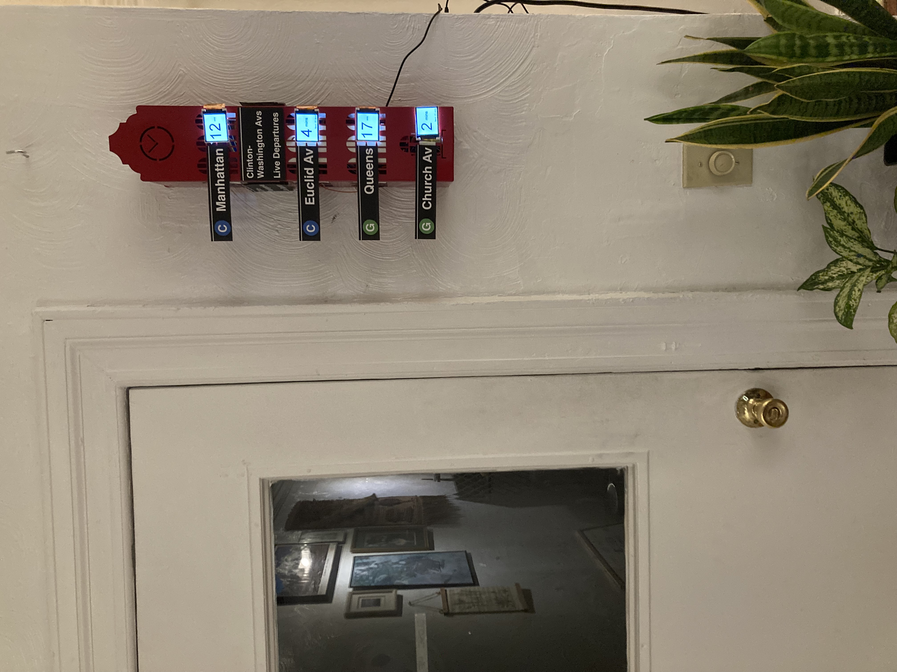
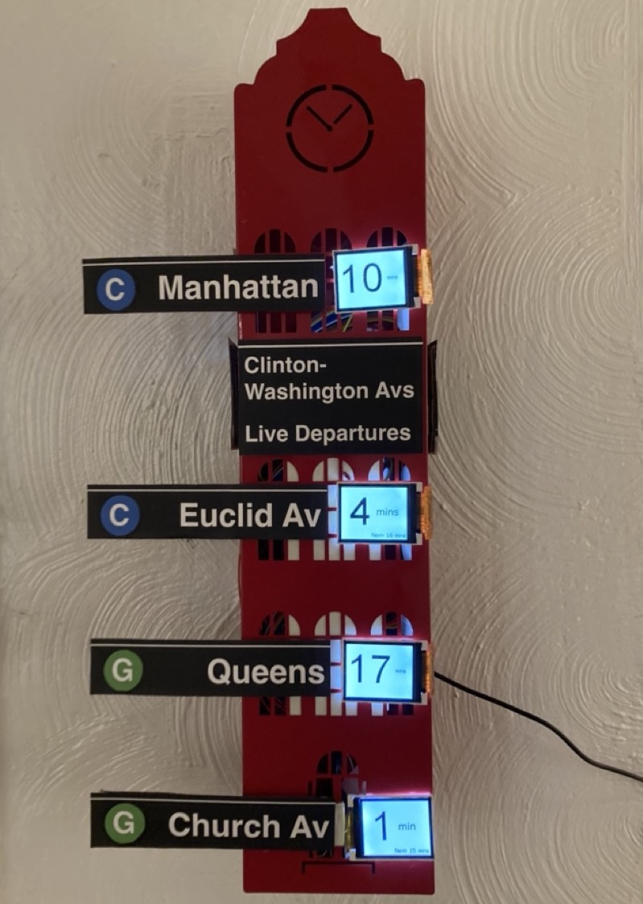
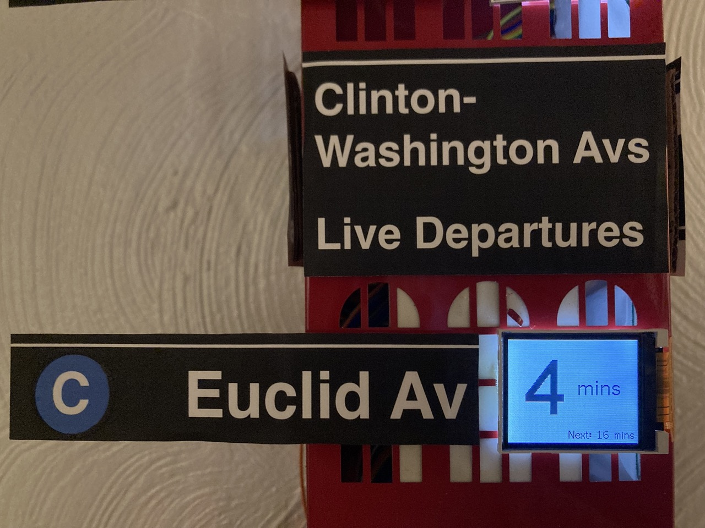
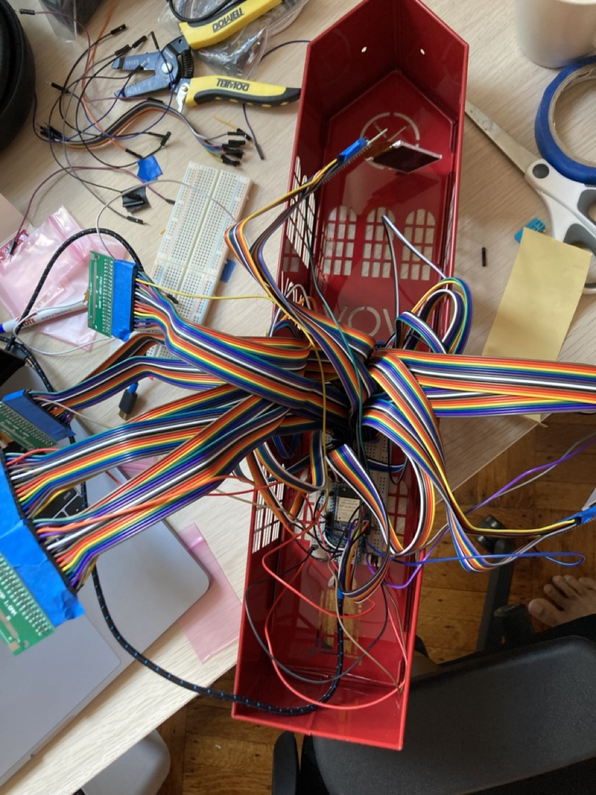

# Choo-Choo Clock 🚂
## Live Subway Departure Board

  
   
  

This project was born out of a deep love for the subway, and a humble desire for "zero platform wait time". For those of us who live next to a stop where the time between trains is 10 minutes or greater, the cost of _juuuust_ missing your train is an eternity of trying to entertain yourself with subway rat drama, and looking longingly up the tracks, waiting for your lil' choo-choo to return from the war (not to mention probably being late to wherever it is you're going).

Now, with a quick glance before leaving home, you can answer questions like "do I have time to fill my water bottle?", and "how quickly do I need to tie my shoelaces?", and "will I need to haul ass on the way to the station?".

* * *

My goal with this repo is to inspire and help others who want to build a similar gizmo (*"a choo-choo clock in every city home!"*). While I'm sure your choo-choo clock will end up very different to this one, I hope the learnings from my journey can at least turn your week-long project into a weekend one.

# Hardware

  

## Screens
I set out to find small screens for cheap, and I ended up using 4 lil **1.8" TFT screens (with a ST7735 driver)**, which you can get from [Adafruit](https://www.adafruit.com/product/618) for 10 bucks each, or [these ones from Sparkfun](https://www.sparkfun.com/products/15094) for 3 bucks each. The latter are the ones that I used, and they're cheaper because they only support "3-wire SPI" instead of the standard 4-wire SPI (and most MCUs/libraries don't support 3-wire SPI); but I *was* able to get them working with the alternative **8-wire parallel interface** instead. If your budget allows for the more expensive Adafruit ones though, I predict they'll save you some hassle.

For either one, you'll probably want something like [this Flat Flex Cable adapter](https://www.adafruit.com/product/4909) so you can wire things up more easily.

If you're going with the **Sparkfun display**, I have some tips. For reference, here are the datasheets for the [display](https://cdn.sparkfun.com/assets/0/b/4/6/8/TF-LCM17723A-N-S0_spec_only-01.pdf) and the [driver](https://cdn.sparkfun.com/assets/9/0/2/5/8/ST7735S_v1.1.pdf).

### Tips
- Even though the driver is technically capable of 4-wire SPI, the Sparkfun module is hardwired to the 3-wire SPI configuration.
- Similarly, the Sparkfun module is also hardwired to 8080 option for the parallel interface.
- If you're not using the Read Enable feature (for reading contents of the display), you should fix that pin HIGH (I had issues when it was fixed at GND).
- Make sure to ground all the data bus pins you're not using.
- The display datasheet has a typo where it mixes up anode and cathode, for the backlight. It *should* say that Pin 33 is connected to the anode, and Pins 34 and 35 are connected to the cathode.

### MCU
I used an *ESP32* since I have a lot of them and I'm familiar with the platform, but in theory you could use any Arduino-y board and still use the same software here as long as it's got internet connectivity and enough pins – you need `{11 + NUM_SCREENS}` for 8-wire parallel, or `{4 + NUM_SCREENS}` for SPI (if you have a screen that supports 4-wire SPI).

You can of course use a totally non-Arduino board as well, and port the firmware; ultimately your MCU just needs to parse some web data and push pixels to the screens.

# Software

## Display Graphics

Many graphics libraries exist that bring support for TFT displays to Aruduino-based boards. However, almost all of them only support traditional 4-wire SPI. Since I was determined to get the cheaper Sparkfun displays to work, I ended up finding this wonderful TFT library called [TFT_eSPI](https://github.com/Bodmer/TFT_eSPI) that, despite its name, is the only library I came across that also has 8-wire parallel support. If you are instead blessed with a SPI screen, you should be fine to use any of the TFT libraries out there.

I've put my TFT_eSPI `User_Setup.h` file in this repo as an example (N.B. to use `#define ST7735_REDTAB` if you're using the Sparkfun screens). I did encounter some bugs with my setup. Namely, some words and numbers at larger font sizes wouldn't show up properly, or at all. I haven't been able to get to the bottom of this yet, but for the Arduino sketch in the this repo I did eventually find a combination of font sizes and text layout that was aesthetically pleasing and also didn't make the library misbehave.

### Debug Print
I ran into issues reading `Serial.print()` output once I had all the screens wired up (ESP32 can have weird pin interference sometimes). In case you run into a similar problem, I wrote a handy `debugPrint()` function in the sketch that makes it easier to directly use one of the TFT screens as a debugging output instead.

## Real-Time Data
The last piece of the puzzle! There are a million and one ways to do this, and it'll be different for each transit agency; I'll briefly give an insight into how I ended up interfacing with NYC MTA data.

MTA's official [Realtime Data Feed](https://api.mta.info/#/landing), like many other cities' transit feeds, is published as a [GTFS Realtime](https://developers.google.com/transit/gtfs-realtime/) feed which in turn is based on [protocol buffers](https://developers.google.com/protocol-buffers/). While it is possible to parse protobuf messages on an ESP, I decided to instead run this [nice proxy server](https://github.com/jonthornton/MTAPI) that consumes the GTFS feed and spits out JSON instead. The proxy server runs as a service that lives on a Raspberry Pi on the same network as the ESP32.

If you use this same proxy server, I recommend two things:

- Make sure to comment out any Feed URLs in `mtapi.py` for lines that don't go to your station. This will drastically speed up the server response time.
- Python is way better than C++ at doing ~time math~, so I have the server calculate the time in seconds till the next train and pop that in a new `countdown` field in the response.

You can see both these changes on [my own fork of the server](https://github.com/aaga/MTAPI).

# That's pretty much it!
Hope this was somewhat interesting and/or helpful to you on your own quest for building something similar.

Please use the [Discussions](https://github.com/aaga/choo-choo-clock/discussions) to share your own setups (bonus points for other cities)! Progress updates and requests for help/advice are also very much welcome there.